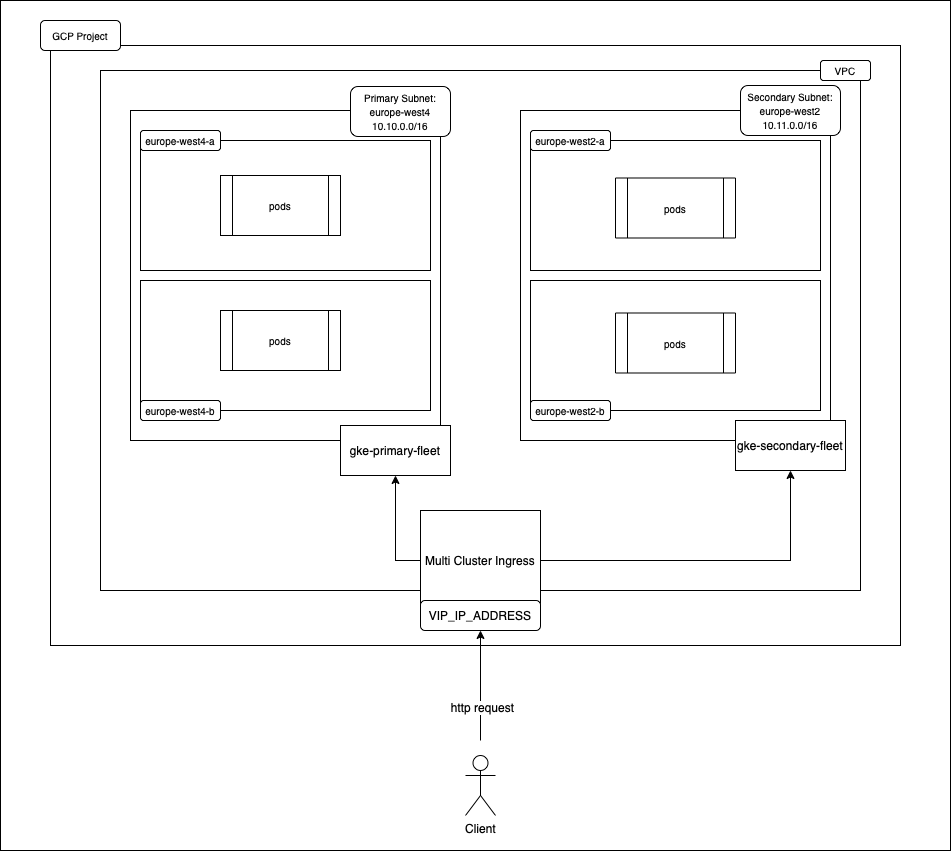

# k8s-multi-region-cluster

One app served from two GKE clusters in two regions, behind a single global entry point.

- `vpc/` - Terraform for a VPC with one subnet in `europe-west4` and one in `europe-west2`
- `gke-primary/`, `gke-secondary/` - Terraform for two GKE Autopilot clusters, one per region
- `deploy/` - a sample app (Google's `whereami`) exposed through a `MultiClusterService` and a `MultiClusterIngress`
- `configuration_commands.sh` - the `gcloud` and `kubectl` steps to register both clusters to a fleet and enable multi-cluster ingress

## Run it

1. Set `project_id` in each `variables.tf` to your GCP project.
2. `terraform apply` in `vpc/`, then in `gke-primary/` and `gke-secondary/`.
3. Follow `configuration_commands.sh`.
4. `kubectl apply -f deploy/` on the config cluster.

`whereami` tells you which cluster answered, so you can watch traffic go to the closest region.

Heads up: this creates real GCP resources that cost money. Run `terraform destroy` when you're done.
